<!--
Author: Konstantin Lübeck (University of Tübingen, Chair for Embedded Systems)
-->

# Setting up a PL to PS interrupt on the Zedboard

This tutorial shows you how to setup a PL to PS interrupt on the Zedboard using Vivado and the Xilinx SDK

## Requirements

- Vivado 2016.4
- Zedboard

## Creating a New Vivado Project

This part is pretty straight forward. You can look up how to setup a new Vivado project here:

[https://github.com/k0nze/zedboard_axi4_master_burst_example#creating-a-new-vivado-project](https://github.com/k0nze/zedboard_axi4_master_burst_example#creating-a-new-vivado-project)

Thoughout this tutorial the name for the Vivado project is `pl_to_ps_interrupt_example`.

## Creating a Custom AXI4 IP

After you successfully created a new Vivado project do the following steps to create a custom AXI IP which will issue the interrupts from the PL to the PS with an AXI slave interface.

1. Open: _Menu -> Tools -> Create and Package IP_.

    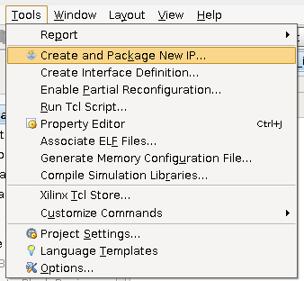


2. Click _Next >_

    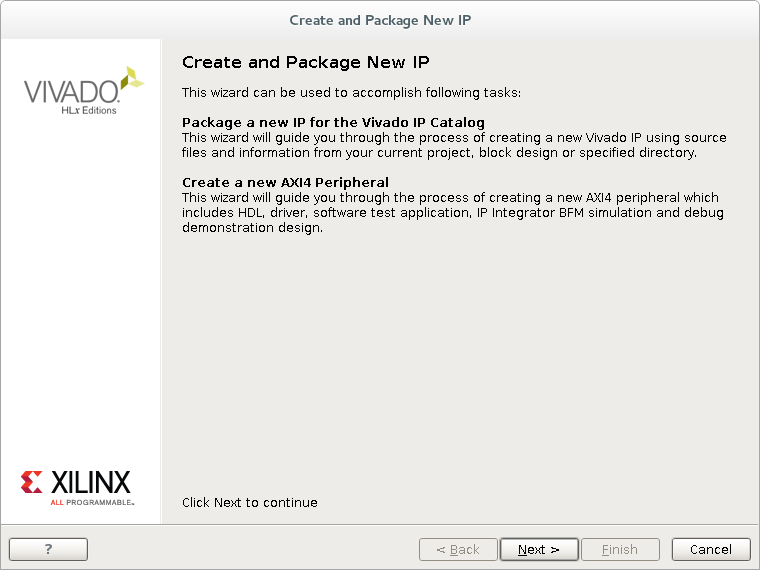


3. Choose _Create a new AXI4 peripheral_.

    


4. Choose a name, description and location for the new AXI4 peripheral. The name in this tutorial is `axi4_pl_interrupt_generator` and the location is `[...]/ip_repo`.

    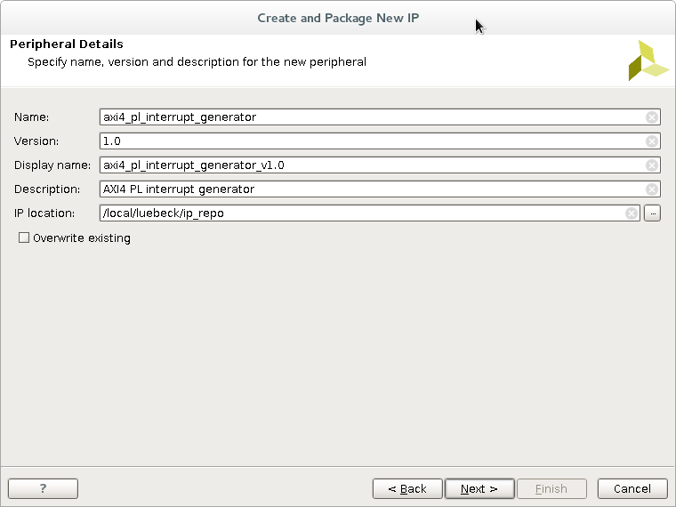


5. Keep the AXI4-Lite slave interface and click _Next >_

    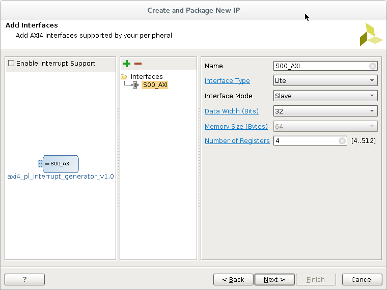


6. Choose _Edit IP_ and click _Finish_

    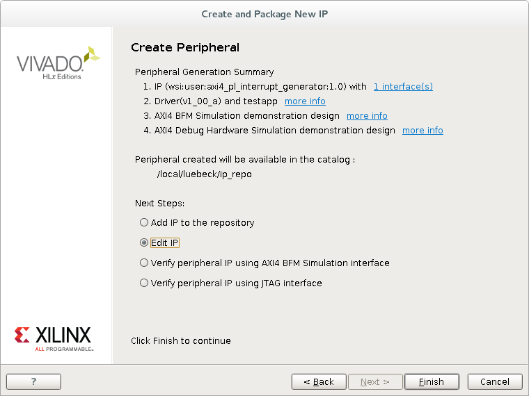


## Edit AXI4 IP

After the successful creation of the new IP a new Vivado project was opened. In this project you can find the Vivado generated Verilog code for the AXI4-Lite slave and a top module (wrapper) which contains the AXI4-Lite slave.


* `axi4_pl_interrupt_generator_v1_0` contains the top module
* `axi4_pl_interrupt_generator_v1_0_S00_AXI_inst`contains the Verilog code for the AXI4-Lite slave.

The AXI4-Lite slave will be used to set and clear the interrupt from the PS.

Double-click on `axi4_pl_interrupt_generator_v1_0_S00_AXI_isnt` and navigate to the ports definition and add your own ports under `// Users to add ports here`.

```verilog
// Users to add ports here
output wire interrupt_0,
output wire interrupt_1,
// User ports ends
```

Those two wires will later be connected to outputs of the top module which will be then connected to the interrupt ports of the PS.

Navigate to `// Add user logic here` and add the following:

```verilog
// Add user logic here
assign interrupt_0 = slv_reg0[0:0];
assign interrupt_1 = slv_reg1[1:1];
// User logic ends
```

This will connect the wires to the LSB of the slave registers 0 and 1 to which the PS can write directly (`slv_reg0[0:0]` and `slv_reg1[0:0]`). 

The newly added ports of the AXI4-Lite slave also have to be added to the module instantiation in the top module `axi4_pl_interrupt_generator`. Double-click on `axi4_pl_interrupt_generator` in the sources tree and navigate to: `// Instantiation of Axi Bus Interface S00_AXI` and add the new ports to the port map:

```verilog
// Instantiation of Axi Bus Interface S00_AXI
axi4_pl_interrupt_generator_v1_0_S00_AXI # ( 
    .C_S_AXI_DATA_WIDTH(C_S00_AXI_DATA_WIDTH),
    .C_S_AXI_ADDR_WIDTH(C_S00_AXI_ADDR_WIDTH)
) axi4_pl_interrupt_generator_v1_0_S00_AXI_inst (
    
    .interrupt_0(interrupt_0),
    .interrupt_1(interrupt_1),
``` 

`interrupt_0`and `interrupt_1` will be connected to `interrupt_0` and `interrupt_1` of the top module. To add `interrupt_0` and `interrupt_1` to the top module navigate to `// Users to add ports here` and add the following:

```verilog
// Users to add ports here
output wire interrupt_0,
output wire interrupt_1,
// User ports ends
``` 

When the PS sets the LSB of `slv_reg0` or `slv_reg1` in the AXI4-Lite slave from 0 to 1 a rising edge will be seen at the output ports `interrrupt_0` and `inpterrupt_1` of the `axi4_pl_interrupt_generator`. This concludes the edits in the Verilog code of the AXI4-Lite slave. 

1. Click on the tab _Package IP - axi\_pl\_interrupt\_generator_.
    
    


2. Click on _File Groups_ in _Packaging Steps_.

    


3. Click on _Merge changes from File Groups Wizard_.

    


4. Click on _Customization Parameters_ in _Packaging Steps_.

    


5. Click on _Merge changes from customization Parameters Wizard_.

    


6. Click on _Review and Package_ in _Packaging Steps_.

    
    

7. Click on _Re-Package IP_.

    
    

8. Click _Yes_ to close the Project for the _axi4\_pl\_interrupt\_generator_.

    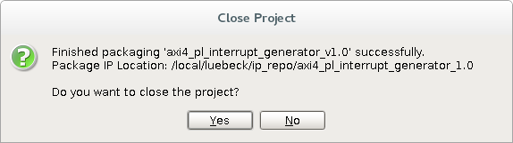
   

You can go back to the Verilog code by clicking on _Flow Navigator -> Project Manager -> IP Catalog_.

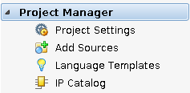

And navigate to _User Repository -> AXI Peripheral -> axi4\_pl\_interrupt\_generator\_v1.0_ and right-click to open the context menu an choose _Edit in IP Packager_.

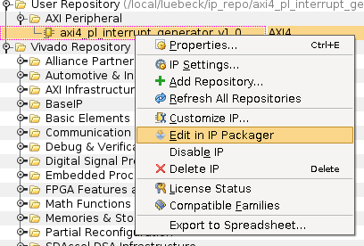


## Zynq Block Diagram

So that your custom AXI4 IP can be implemented on the Zynq PL and connected to the Zynq PS you have to create a block diagram in Vivado. The following steps will show you how to do that:

1. Click on _Flow Navigator -> IP Integrator -> Create Block Diagram_.

    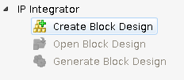


2. Choose a name, directory, and specify a source set for the block diagram. In this tutorial everything stays at the default.

    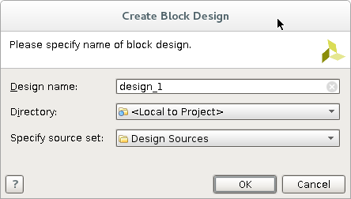


3. Right-click on the white background of the _Diagram_ tab and choose _Add IP_.

    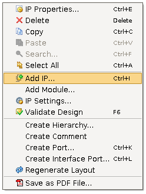

4. From the list of IPs choose _ZYNQ7 Processing System_ (this is the Zynq PS) and double-click on it. 

    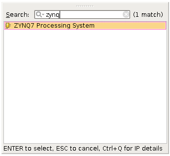


5. You can now see the Zynq PS in the block diagram. Click on _Run Block Automation_ to connect the Zynq PS with the memory.

    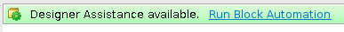


6. Leave everything at the default values and click on _OK_.

    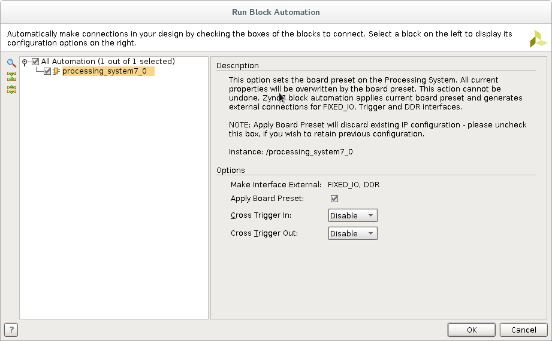


7. To connect the interrupt ports of your AXI4 IP to the Zynq PS the Zynq PS needs interrupt ports. To enable those interrupt ports double-click on the Zynq PS in the block diagram.

    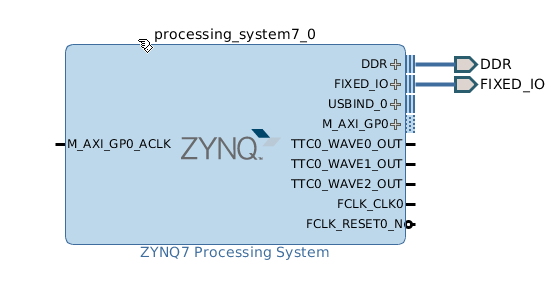

8. In the _Re-customize IP_ window go to _Page -> Navigator -> Interrupts_.

    


9. Unfold _Fabric Interrupts -> PL-PS Interrupt Ports_ and check _IRQ\_F2P[15:0]_ and click _OK_.

    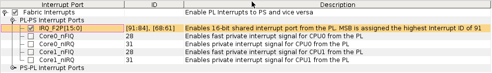


10. Now its time to add your custom AXI4 IP. Right-click on the white background of the _Diagram_ tab and choose _Add IP_.

    


11. From the list of IPs choose _axi4\_pl\_interrupt\_generator\_v1.0_ (this is your custom AXI4 IP) and double click on it to add it to the block diagram. 

    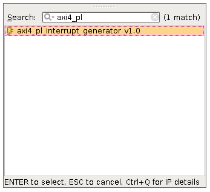


12. Click on _Run Connection Automation_ to connect your custom AXI4 IP to the Zynq PS via the AXI4 bus. 

    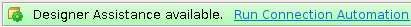


13. Check _S00\_AXI_ in the tree on the left-hand side. Select _/processing\_system7\_0/FCLK\ CLK0_ in the list of _Clock Connections_ and click on OK.

    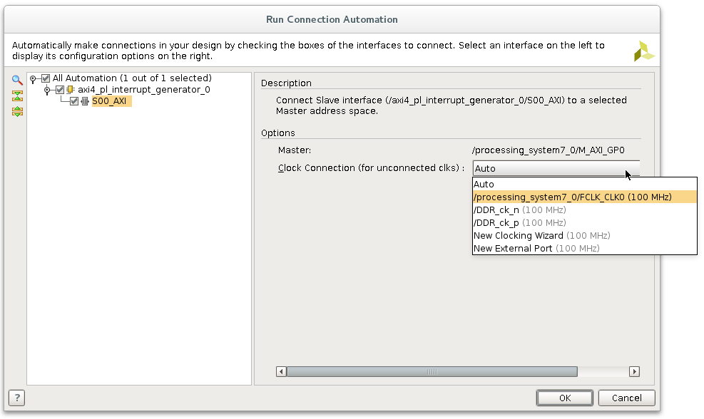


14. After the connection automation is done click on  to regenerate the layout of the block diagram. Your block diagram should now look like this:

    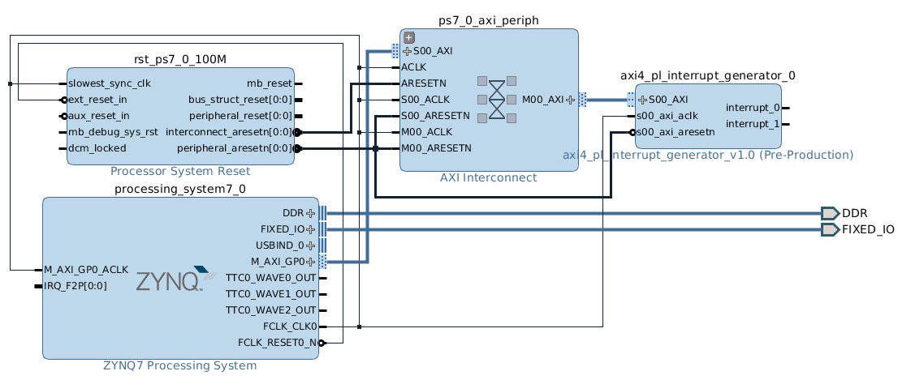


15. To connect the _interrupt\_0_ and _interrupt\_1_ outputs of your custom AXI4 IP to the Zynq PS. Add another module by right-clicking on the white background and choose _Add IP_ and select _Concat_.

    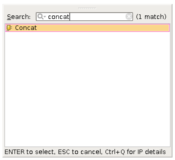


16. Connect the _In0_ and _In1_ inputs of the _xlconcat\_0_ module to the _interrupt\_0_ and _interrupt\_1_ outputs of your custom AXI4 IP by hovering with the curser over on of _interrupt\_*_ outputs and drawing a line a with the pencil to one of the _In*_ inputs. Do this for both _interupt\_*_ outputs.

    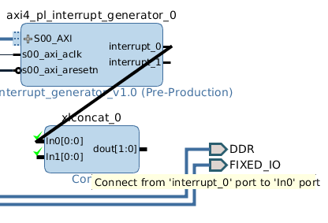


17. Afterwards connection the _dout_ output of the _xlconcat\_0_ to the _IRQ\_F2P_ input of the Zynq PS.

    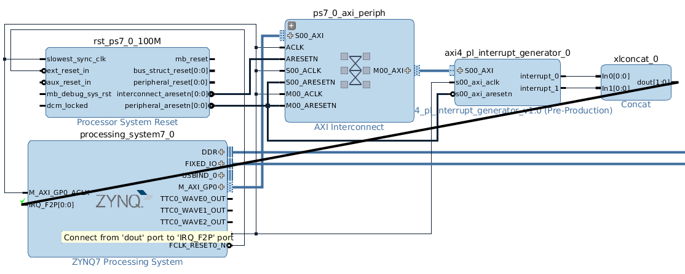


18. The block diagram is now finished. In the _Sources Panel_ navigate to _Design Sources -> design\_1_.

    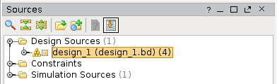


19. Right-click on _design\_1_ and choose _Create HDL Wrapper_. This generates HDL code for the block diagram which is necessary for the synthesis.

    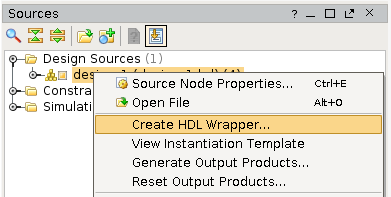


20. Choose _Let Vivado manage wrapper and auto-update_ and click _OK_. This will always update your HDL wrapper when the block diagram was changed.

    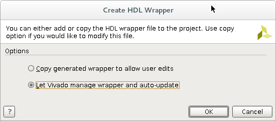


21. Afterwards output products for the your block diagramm have to generated. Navigate in the Sources Panel to _design\_1\_i_, right-click on it and choose _Generate Output Products_

    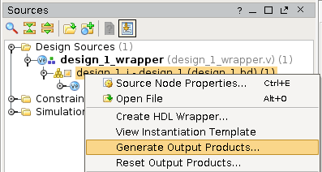


22. Leave everything at its default and click _Generate_. 

    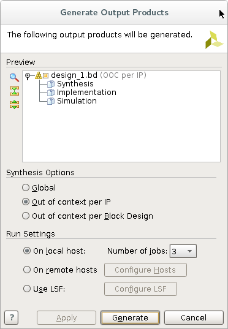


## Synthesis and implementation
To bring the custom AXI4 IP with the block diagram to the Zynq PL you have to synthesize and implement it.

1. Start the synthesis by click on Run Synthesis in _Flow Navigator -> Synthesis_.

    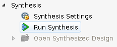


2. Leave everything at its default and click _OK_ to launch the systhesis. 

    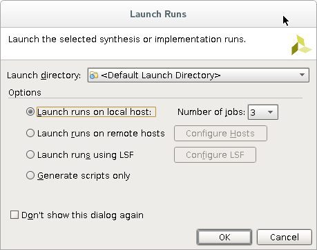


3. After the synthesis is finished choose _Run implementation_ and click on _OK_ to run the implementation.

    


4. When the implementation is finished choose _Generate Bitstream_ and click on _OK_ to generate the bitstream which contains the configuration data for the Zynq PL. 

    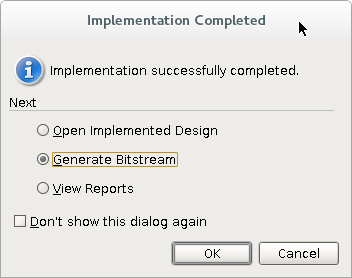


5. Lastly, when the bitstream generation is finished you can look at the reports to see if all contraints are fulfilled. Choose _View Reports_ and click OK. (However, this is not necessary here since the design is very simple).

    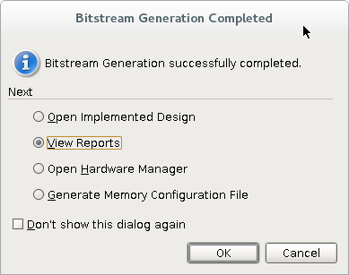
